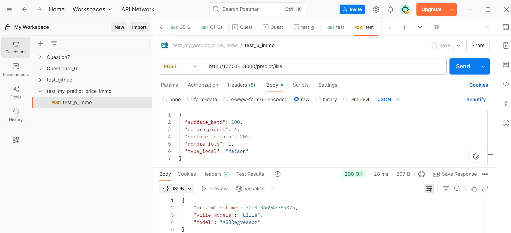
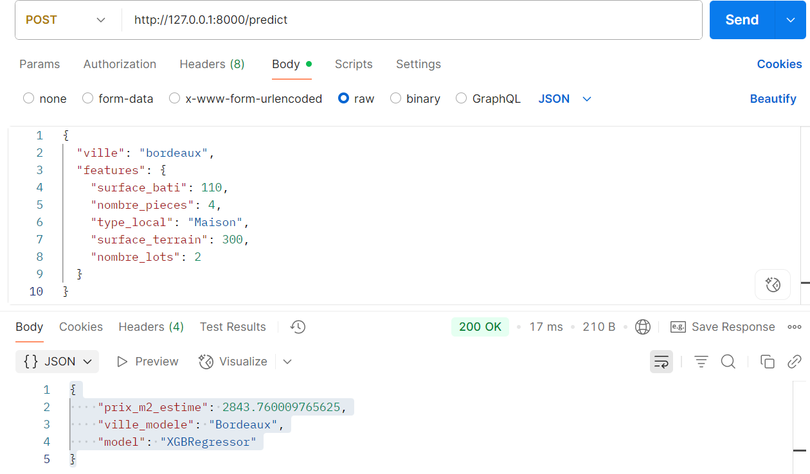
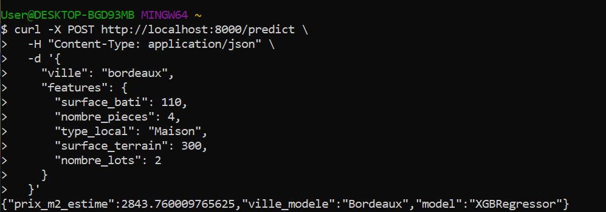
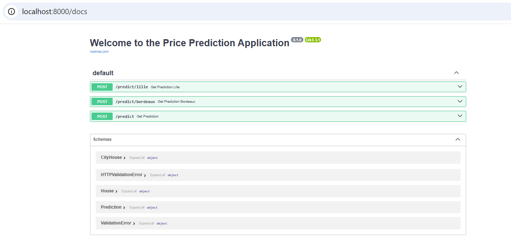

# Prédiction du prix au m² en immobilier en France

## Contexte

Une agence immobilière souhaite intégrer un outil d’estimation automatique du **prix au m²** dans ses applications internes. L’objectif est de mieux appuyer les décisions commerciales sur le marché immobilier des villes de **Lille** et **Bordeaux**, en s’appuyant sur les données publiques de transactions immobilières.

## Démarche 

### 🏗️ Phase 0 : Préparation des Données de valeur foncière (DVF) 
Nettoyage des données DVF 2022 pour Lille et Bordeaux afin de préparer l'analyse.

Étapes :

Chargement du fichier brut (format .txt, séparateur |)

Filtrage : ventes à Lille ou Bordeaux avec surface bâtie et valeur foncière non nulles

Conversion des valeurs en float

Calcul du prix au m²

Export des jeux de données nettoyés :

data/lille_2022.csv

data/bordeaux_2022.csv

### 📊 Phase 1 — Modélisation du prix au m² à Lille (2022) pour les logements de 4 pièces

Objectif : construire un modèle de prédiction du prix au m² à Lille en 2022, pour les logements de 4 pièces, en distinguant appartements et maisons.

🔍 Étapes clés
Chargement des données lille_2022.csv

Filtrage : logements avec 4 pièces

Séparation des jeux de données : appartements / maisons

Sélection des variables pertinentes :

Surface reelle bati, Valeur fonciere, Nombre de lots, etc.

Création de la cible :
prix_m2 = Valeur fonciere / Surface reelle bati

Nettoyage : suppression des valeurs manquantes et aberrantes

Split train/test (80/20)

Entraînement des modèles :

LinearRegression, DecisionTreeRegressor, RandomForestRegressor

Optimisation avec GridSearchCV

Ajout d’un modèle avancé : XGBRegressor

Évaluation via le MSE et comparaison des performances par type de bien

👉 Cette étape pose les bases d’un futur outil d’estimation différencié appartement vs maison.

### 🧪 Phase 2 — Test de Généralisation sur Bordeaux
🎯 Objectif
Évaluer la capacité de généralisation des modèles entraînés sur Lille en les testant sur les logements 4 pièces vendus à Bordeaux en 2022.

Deux cas sont étudiés séparément :

🏢 Appartements

🏠 Maisons

📋 Étapes
Charger les données de Bordeaux : data/bordeaux_2022.csv

Appliquer les mêmes filtres que pour Lille (logements 4 pièces vendus en 2022)

Séparer en deux sous-ensembles : Appartements et Maisons

Prétraitement identique à Lille :

Calcul du prix_m2

Sélection des colonnes clés :

Surface reelle bati

Nombre pieces principales

Type local

Surface terrain

Nombre de lots

Nettoyage (valeurs manquantes, outliers)

Appliquer les modèles de Lille (⚠️ pas de réentraînement)

Prédiction des prix_m2 sur Bordeaux

Calcul des erreurs quadratiques moyennes (MSE)

Comparer les performances entre Lille et Bordeaux :

### 🌐 Phase 3 — API REST d'estimation du prix au m² (FastAPI)
Objectif : exposer les modèles prédictifs de Lille (Phase 1) et Bordeaux (Phase 2) via une API REST professionnelle et réutilisable.

🚀 Fonctionnalités
API construite avec FastAPI

Deux modèles chargés (Lille & Bordeaux)

3 endpoints :

/predict/lille — prédiction avec le modèle de Lille

/predict/bordeaux — prédiction avec le modèle de Bordeaux

/predict — sélection dynamique de la ville via le payload

La documentation interactive de l'API est automatiquement générée avec Swagger UI, accessible à l'adresse /docs.

